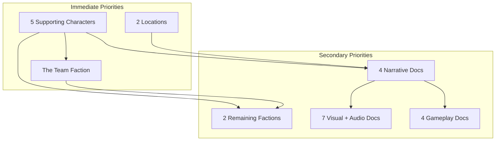

# World Bible Completion Plan

## Scope

25 files need expansion from placeholders (34-99 lines each) to full content (300-2300+ lines each), following established templates in `.cursor/rules/`.

---

## Phase 1: Supporting Characters (5 files)

Each file is currently a 44-47 line placeholder. Target: ~300-900 lines each following the 10-section template in [character-development.mdc](.cursor/rules/character-development.mdc). Use [Vibrion.md](WorldBible/03_Characters/Heroes/Vibrion.md) (327 lines) and [Anne.md](WorldBible/03_Characters/Heroes/Anne.md) (694 lines) as reference models.

**Recommended order** (based on narrative dependencies -- later characters reference earlier ones):

1. **Dr. Entropy** ([DrEntropy.md](WorldBible/03_Characters/Antagonists/DrEntropy.md)) -- Primary antagonist; Enigma Volt and The Mentor both depend on his profile. His philosophy (controlled chaos) is central to faction and narrative docs.
2. **Enigma Volt** ([EnigmaVolt.md](WorldBible/03_Characters/Antagonists/EnigmaVolt.md)) -- Secondary antagonist, Dr. Entropy's ally. Can reference the completed Dr. Entropy profile.
3. **The Mentor** ([TheMentor.md](WorldBible/03_Characters/Antagonists/TheMentor.md)) -- Has a hidden connection to Dr. Entropy. Some mystery should be preserved (per INDEX.md "Mysteries to Preserve"). Balance detail with intentional ambiguity.
4. **Dr. Volt** ([DrVolt.md](WorldBible/03_Characters/Mentors/DrVolt.md)) -- Vibrion's mentor, temporal physicist. Relatively independent; draws from universe fundamentals docs.
5. **Dr. Mental** ([DrMental.md](WorldBible/03_Characters/Mentors/DrMental.md)) -- Psycho-temporal therapist, team advisor. Connects to all heroes' mental health profiles.

**Sections required per character** (from template):

- Biography, Psychology and Personality, Abilities and Skills, Relationships (with all 12 characters), Temporal Profile, Visual and Aesthetic Design, Voice and Communication, Cultural and Background, Story Function, Cross-References

**Key guidelines:**

- Antagonists need a "Philosophy and Motivation" subsection explaining their worldview
- The Mentor must leave true identity/origins deliberately vague
- Mentors should show how they relate to each hero's condition
- All must follow mental health representation rules (no "cure" narratives, conditions as strengths)

---

## Phase 2: Remaining Locations (2 files)

Each is a 99-line placeholder. Target: ~1,800-2,300 lines following the 11-section template in [locations-worldbuilding.mdc](.cursor/rules/locations-worldbuilding.mdc). Use [TimeNexus.md](WorldBible/04_Locations/TimeNexus.md) (2,356 lines) and [ChronopolisCentral.md](WorldBible/04_Locations/ChronopolisCentral.md) (2,322 lines) as reference models.

1. **Contemplative Sanctuaries** ([ContemplativeSanctuaries.md](WorldBible/04_Locations/ContemplativeSanctuaries.md))
  - Location type: Dilated temporal zone (slow time)
  - Spectrum position: Autonomous (self-governed contemplative communities)
  - Thematic connection: Dave's dilated time perception; depression as depth
  - Key sections: Temporal properties (low RFR), societal structure, daily life, culture focused on reflection/artisan craft, neurodivergent-designed spaces
2. **Accelerated Quarter** ([AcceleratedQuarter.md](WorldBible/04_Locations/AcceleratedQuarter.md))
  - Location type: Urban zone at 3.0 RFR (accelerated time)
  - Spectrum position: Autonomous (innovation-focused, fast-paced)
  - Thematic connection: Anne/Eli's accelerated perception; ADHD/anxiety as speed
  - Key sections: Temporal properties (high RFR), rapid economics, flex work culture, sensory environment, how characters experience accelerated time differently

**Both locations must include:**

- 8-dimension cultural diversity profile
- "Average Day" framework
- AC-inspired societal structure
- Mixtopia principle (benefits AND drawbacks)
- Cross-references to characters who originate from or connect to these zones

---

## Phase 3: The Team Faction (1 file)

[TheTeam.md](WorldBible/05_Factions/TheTeam.md) is a 90-line outline. Target: ~500-800 lines following the 9-section faction template embedded in the file's own checklist.

**Content to develop:**

- Formation story (how Vibrion assembled the team)
- Organizational structure and decision-making process
- Team protocols (mission procedures, communication, emergency responses)
- Internal dynamics (draws heavily from the 7 completed hero relationship webs)
- Resources (headquarters at Time Nexus, equipment, funding)
- Philosophy (neurodiversity as operational strength)
- Training regimen and ability development programs
- Relationship to Temporal Research Council (formal? informal? sanctioned?)

---

## Phase 4: Remaining Factions (2 files)

Both are 90-line placeholders. Target: ~500-800 lines each.

1. **Temporal Research Council** ([TemporalResearchCouncil.md](WorldBible/05_Factions/TemporalResearchCouncil.md))
  - Governance body for temporal civilization
  - Headquarters in Chronopolis Central (draw from that completed location)
  - Relationship to The Team, to autonomous zones, to Dr. Entropy
  - Political structure, authority limits, internal tensions
2. **Entropy Forces** ([EntropyForces.md](WorldBible/05_Factions/EntropyForces.md))
  - Dr. Entropy's organization (draw from his completed character profile)
  - Structure, recruitment, philosophy of controlled chaos
  - Resources, territory (Fractured Wastes, Dr. Entropy's Lair -- both completed locations)
  - Relationship to other factions

---

## Phase 5: Narrative Design (4 files)

All are 34-line placeholders. Target: ~200-500 lines each, guided by [narrative-structure.mdc](.cursor/rules/narrative-structure.mdc).

1. **StoryStructure.md** ([StoryStructure.md](WorldBible/06_Narrative/StoryStructure.md)) -- Expand the Non-Linear Resonance Model (4 acts already defined in the cursor rule). Detail act breakdowns, resonance points, how character arcs map to acts.
2. **Themes.md** ([Themes.md](WorldBible/06_Narrative/Themes.md)) -- Primary/secondary/tertiary themes (already outlined in cursor rule). Add motifs, symbols, thematic execution examples per character.
3. **ChapterBreakdown.md** ([ChapterBreakdown.md](WorldBible/06_Narrative/ChapterBreakdown.md)) -- 20-chapter breakdown across 4 acts. Per chapter: summary, POV character, key events, themes, temporal mechanics in play, ability usage, character arc progression.
4. **WritingGuidelines.md** ([WritingGuidelines.md](WorldBible/06_Narrative/WritingGuidelines.md)) -- Tone, voice, POV rules, dialogue style, pacing per character (much of this exists in the cursor rule and can be expanded with examples and edge cases).

---

## Phase 6: Visual and Audio Design (7 files)

All are 37-45 line placeholders/frameworks. Target: ~200-400 lines each.

**Visual Design (4 files):**

1. **OverallAesthetic.md** -- Art direction, cinematic realism + fantastical elements, environmental storytelling
2. **TemporalVisuals.md** -- VFX for time distortions, per-ability visual effects, temporal zone visual language
3. **CharacterDesigns.md** -- Per-character visual specs (can draw from the completed hero dossier "Visual Design" sections)
4. **ColorPalettes.md** -- Per-character and per-zone color schemes with hex values

**Audio Design (3 files):**
5. **CharacterThemes.md** -- Currently has 2 themes (Vibrion, Leo). Expand with 5 remaining hero themes + mentor/antagonist themes. Instrumentation, tempo, key, emotional arc.
6. **TemporalSoundscape.md** -- Temporal sound effects, zone ambience, time distortion audio. Fix misplaced character theme content.
7. **MusicDirection.md** -- Overall musical direction, adaptive music system, genre guidelines. Fix misplaced character theme content.

---

## Phase 7: Gameplay Mechanics (4 files)

All are 37-line placeholders. Target: ~300-500 lines each.

1. **CoreLoop.md** -- Core gameplay loop, character switching, temporal manipulation integration, progression systems
2. **CharacterGameplay.md** -- Per-character ability mechanics, controls, skill trees (draw from hero dossier "Gameplay Applications" sections)
3. **PuzzleDesign.md** -- Puzzle types (from narrative-structure.mdc), difficulty progression, accessibility, hint systems
4. **TeamMechanics.md** -- Ability combos, team synergies, switching strategies (draw from hero dossier relationship/gameplay sections)

---

## Execution Notes

- **Dependencies:** Phases 1-3 are the immediate priorities. Phases 4-7 are secondary but depend on earlier phases for cross-references.
- **Cross-referencing:** After each file is completed, add cross-reference links to related existing docs.
- **README/INDEX updates:** After all phases complete, update [README.md](README.md) and [00_INDEX.md](WorldBible/00_INDEX.md) status trackers to reflect completion.
- **Parallelism:** Within each phase, files that don't depend on each other can be worked on concurrently (e.g., Dr. Volt and Dr. Mental in Phase 1; the two locations in Phase 2; all 4 gameplay files in Phase 7).

