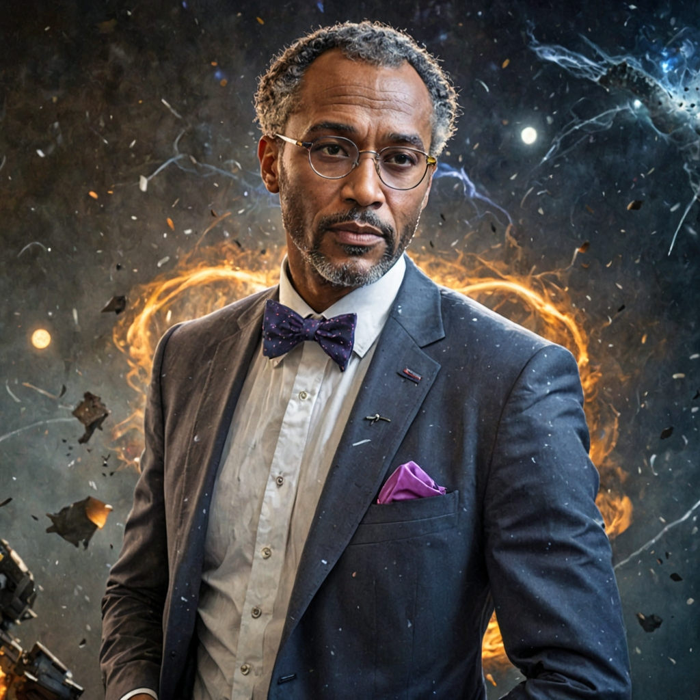

# Dr. Mental - Psycho-Temporal Therapist & Advisor

**Part III: Characters | Mentors**  
**Status:** 📝 OUTLINE - TO BE EXPANDED

---

## Quick Reference

**Full Name:** Dr. Mental [First name TBD]  
**Age:** ~50-60s  
**Role:** Psycho-Temporal Therapist & Advisor  
**Visual Reference:** 

---

## Key Information

[Brief background and role from original docs]

**Relationship to Story:**
- [Primary narrative function]
- [Key relationships]
- [Thematic significance]

---

## Sections to Complete

This should be expanded into a full mentor profile including:
- Complete background and history
- Personality and approach
- Relationship with each team member
- Contributions to team success
- Personal stakes in the conflict
- Visual design and voice

---

**Cross-References:**
- [Vibrion](../Heroes/Vibrion.md) - Primary mentee
- [The Team](../../05_Factions/TheTeam.md) - Team dynamics

---

*[Return to Index](../../00_INDEX.md)*
